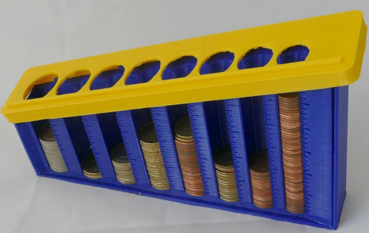

## Purpose

This project demonstrates usage of the AWS EventBus service. You will see examples of:
- Sending events to the event bus and discreetly routing them via event rules
- Reprocessing events from the event archive

## Overview

A demo project simulating a coin sorter - the kind that you can dump a pocketful of change into and it automatically separates them into separate silos, like this example:  

## Requirements

You will need:
- [Terraform](https://developer.hashicorp.com/terraform/tutorials/aws-get-started/install-cli) 
- An AWS account with access to create resources.
- [AWS CLI](https://docs.aws.amazon.com/cli/latest/userguide/cli-chap-getting-started.html) installed and configured
- Python for the testing scripts.
- The publish script is written in bash, but may work in PowerShell also.

## Disclaimer
Although the services used in this tutorial might be inexpensive to most, they are not free. I am not responsible for any charges you incur, use at your own risk. I encourage you to be diligent with the [AWS Pricing Calculator](https://calculator.aws/#/addService) to help protect yourself from unexpected expenses.

Services used in this demo project include:
- SQS
- EventBridge Event Bus
    - Event Bus Archive
- IAM Policies

# Labs
- [Lab 0 - Prep - Setting Environment Variables](labs/lab_prep.md)
- [Lab 1 - Event Bus and Event Rules](labs/lab_1.md)
- [Lab 2 - Replaying Events from the Archive](labs/lab_2.md)

