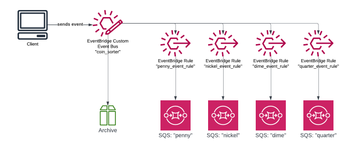
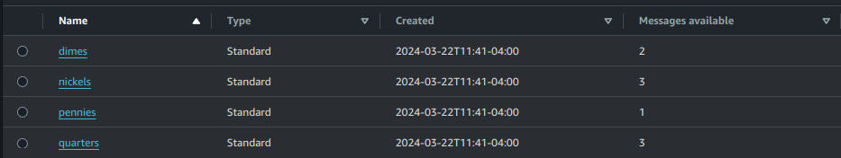

# Lab 1 - Event Bus and Event Rules

> **NOTE:** All lab instructions are intended to be executed from the project root folder.

This lab will deploy resources to only your primary region. Start by running the publish script for lab 1:
```sh
./publish.sh 1
```

You will be prompted by Terraform to apply the changes to your account:
```sh
Plan: 17 to add, 0 to change, 0 to destroy.

Do you want to perform these actions?
  Terraform will perform the actions described above.
  Only 'yes' will be accepted to approve.

  Enter a value: yes

module.sorter.aws_cloudwatch_event_bus.coin_sorter: Creating...
module.sorter.aws_sqs_queue.pennies: Creating...
```

After this, you should see these resources in your account:
- SQS 'penny', 'nickel', 'dime', and 'quarter'
- event bus 'coin_sorter'
- event bus rules 'penny_event_rule', etc  



Now let's send some events to the bus! In tester.py we are generating some json 'coins' that look like this:
```json
{'type': 'nickel', 'year': 2013}
{'type': 'quarter', 'year': 1989}
{'type': 'dime', 'year': 1989}
{'type': 'penny', 'year': 2006}
```
...and wrapping them in [AWS's prescribed event structure](https://docs.aws.amazon.com/eventbridge/latest/userguide/eb-events-structure.html) like this:
```json
{'Source': 'pocket-change', 'DetailType': 'nickel', 'Detail': '{"type": "nickel", "year": 2003}', 'EventBusName': 'coin_sorter'}
{'Source': 'pocket-change', 'DetailType': 'penny', 'Detail': '{"type": "penny", "year": 1917}', 'EventBusName': 'coin_sorter'}
{'Source': 'pocket-change', 'DetailType': 'penny', 'Detail': '{"type": "penny", "year": 1978}', 'EventBusName': 'coin_sorter'}
```

Once they are posted to the event bus, each rule will filter for its target's desired events using [event patterns](https://docs.aws.amazon.com/eventbridge/latest/userguide/eb-event-patterns.html#eb-create-pattern). My event patterns look into the 'detail' node of the event json (the actualy coin payload), then compare the 'type' to a string constant to determine whether the event should pass or not. Here is the filter rule for pennies, allowing them to pass through to the 'penny' SQS:
```json
{
  "detail": {
    "type": [{
      "equals-ignore-case": "penny"
    }]
  }
}
```
## Testing!
So let's try it! Execute the tester script to send some coins to the event bus:
```sh
# activate the python venv
$ source .venv/bin/activate
$ python tester.py -cc 100
{'type': 'penny', 'year': 1930}
{'type': 'nickel', 'year': 2014}
{'type': 'penny', 'year': 1943}
{'type': 'dime', 'year': 1923}
{'type': 'quarter', 'year': 1955}
{'type': 'nickel', 'year': 1900}
{'type': 'quarter', 'year': 1924}
{'type': 'nickel', 'year': 1979}
{'type': 'penny', 'year': 1976}
{'type': 'nickel', 'year': 1976}
```
You should now see messages available in your SQS console.  
_**Note that your messages may not add up to 10 because the script also generates some 'dollar' coins, which we are not handling yet.**_
  

You can run more tests with varying amounts of coins. 
Adding '-p' will empty the queues before sending the events. *The SQS API will only allow one purge call every 60 seconds, you may see an error regarding this, or attempts to purge queues that don't exist yet but will in later labs.*    
Purging queues and sending 100 coins:
`python tester.py -p -cc 100`  

# Lab 1 Complete!
New you've seen some basic usage of Event Bus. You can proceed to [Lab 2 - Archiving and Event Replay](lab_2.md), or if you are done, teardown with:
```sh
./destroy.sh
```