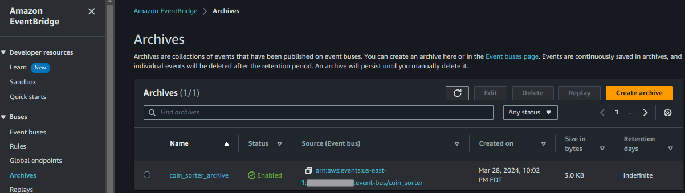
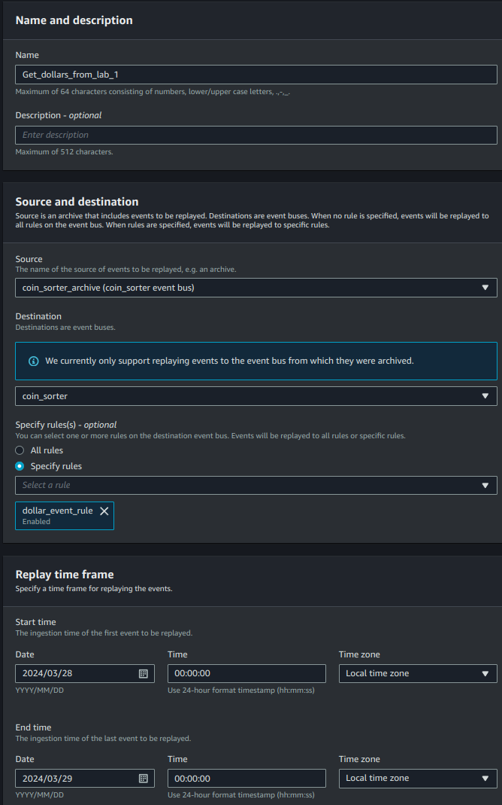
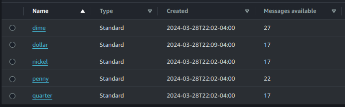

# Lab 2 - Archiving and Event Replay

> **NOTE:** All lab instructions are intended to be executed from the project root folder.

This lab will deploy resources to only your primary region. Start by running the publish script for lab 2. If your resources are still standing from lab 1 that is fine, this will build on them:
```sh
./publish.sh 2
```

If your resources are NOT left standing from lab 1 (if this is a fresh build), go ahead and send some events to your new event bus, these will be needed in a moment.
```sh
# activate the python venv
$ source .venv/bin/activate
$ python tester.py -cc 100
{'type': 'penny', 'year': 1930}
{'type': 'nickel', 'year': 2014}
{'type': 'dollar', 'year': 1943}
{'type': 'dime', 'year': 1923}
{'type': 'quarter', 'year': 1955}
...
...
```
In lab 1 we created some events for various coin types, including a 'dollar' coin, but there was no rule or target for handling dollar coins. We are going to use an event replay to catch those coins, but it can take a few minutes for events to make it to the event bus archive, so go take a 5-10 minute break. Go fill a cup/mug/chalice/stein with your favorite beverage, I like coffee myself, then wend your way back here.  

To ensure the archive is ready you should see "Size in bytes" appear as anything greater than 0.  
  

Now let's do a replay! Select the archive and then the Replay button. Enter your settings similar to below (adjusting for date). Notice that you can select replaying events to ALL rules or just a subset of rules, in this case we want to catch those dollars we missed so we are going to select only the dollar event rule:  
  
Now click "Start Replay". It may take a few moments to start, but should complete quickly. If you check SQS now you should see that the dollar queue has your missing money.  
  
